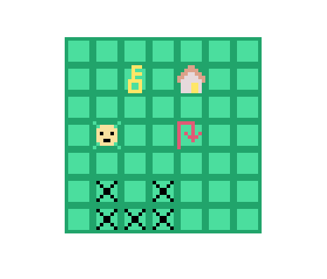

# Re-DDLE

**Author:** Ziyu Li

**Design:** This is a grid-based puzzle game that repeat your movement sequence backwards. In order to get to the door, you need to think in both forward and backward direction.

**Screen Shot:**

**How does the Asset Pipeline Works:**

**Authoring:**

- Color Palette: Color palette is designed to be an 4*8 pixel png image drawn in GIMP. Each row of the image corresponds to a palette in PPU446.
- Sprites: All sprites are 8*8 png images in dimension for convenience, authored in GMIP.

**Write to Runtime Format:**

A python script is utilized to achieve this:

1. First read in the color palette png file. Convert every rgba value into 4*4=16 bytes and write to a binary file. Every 16 bytes is a color palette that will be later loaded during runtime. Keep an array of palette for later lookup.
2. Then for each sprite png file, first iterate through all the unique colors it has, and find the color palette that has all the colors. Write the index (0-7) of the palette as the first bit of the .bin file. Then for each pixel in the png file, iterating in row major, bottom up manner, find the 2-bit index that correspond to the previous fixed palette. There are a total of 64 pixels, which convert to 16 bytes of 2-bit index. Write the 16-byte index chunk into the .bin file.

**Read at Runtime**:

1. Read color_palette.bin, store each 16 byte into a palette.
2. Read all sprite.bin and store them into tiles. Keep a mapping between tile_type(a enum defined) and tile index(uint8_t), and a mapping between tile_type to palette_index(uint8_t) for easy access later.

**How To Play:**

Unfortunately I ran out of time implementing this game. Right now the game will load one level's map, and you can press the arrow keys to move around a little. That's all there is... unfortunately. I will remember to start very early next time. (Sorry, was caught up in Balder's Gate this week)

However, this is a remake of one of my game jam games, so if anyone's interested in playing a puzzler... here's the link: https://vvvpollo.itch.io/re-d

This game was built with [NEST](NEST.md).

